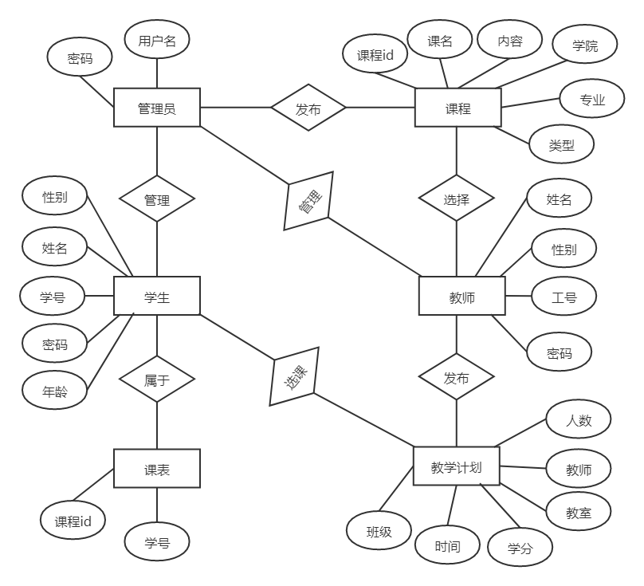
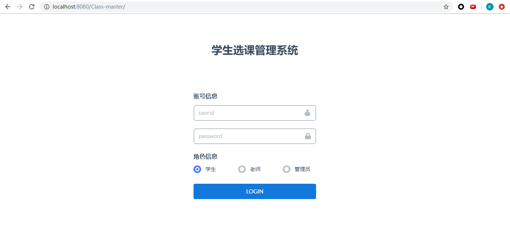

# 学生在线选课系统
系统开发环境：IntelliJ IDEA 
开发语言：Java 
数据库：MySQL 
运行平台： Windows 10 
相关技术：Spring+SpringMVC+MyBatis 

## 系统结构图

</img>

## 系统ER图

</img>

## 系统界面设计 
### 登录模块 

</img>

### 学生模块

</img>

### 教师模块

</img>

### 管理员模块

</img>

